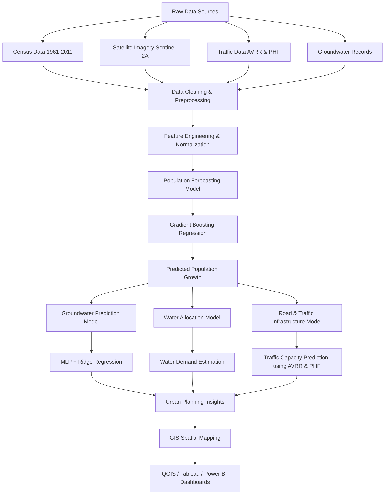

# Urban Planning using Remote Sensing Image Interpretation

## 📌 Project Overview
This project, developed as part of the **Engineering Project in Community Service (EPICS)** at **VIT Bhopal University**, presents a data-driven urban planning model for **Sehore** and the surrounding districts of Madhya Pradesh. By leveraging satellite imagery, Geographic Information Systems (GIS), and Machine Learning, the system provides actionable insights for sustainable growth, efficient resource allocation, and infrastructure development.

---

## 🗺️ The Madhya Pradesh Context: Why This Project Matters
The terrain of Madhya Pradesh (MP) presents unique geographical and structural challenges that necessitated a specialized approach:

* **Topographical Diversity:** MP features a mix of the Malwa Plateau, the Narmada Valley, and rugged hill ranges. These variations mean that a "one size fits all" urban plan is impossible. Our project uses Remote Sensing to identify specific land suitability based on these terrains.
* **Water Scarcity & Drainage:** With its central location, the state relies heavily on groundwater and seasonal rivers. The terrain's natural slope and soil composition require precise mapping to ensure new urban settlements have sustainable water access and proper drainage to prevent flooding.
* **Rapid Semi-Urban Transition:** Regions like Sehore are transitioning from agricultural hubs to industrial/residential extensions of Bhopal. Without the GIS-based monitoring used in this project, this "urban sprawl" risks destroying fertile land and depleting the local water table.
* **Resource Distribution:** The vast, often uneven landscape makes traditional physical surveying slow and expensive. Remote Sensing provides a cost-effective way to monitor forest cover, wasteland, and built-up areas across the state’s challenging terrain.

---

## 🧪 Personal Case Study: The Catalyst for Change
This project is born out of a direct response to the infrastructural challenges we witness daily. Our primary inspiration stems from the **Bhopal-Indore corridor**, a critical lifeline for the state.

While official reports designate this as a 6-lane highway, the reality on the ground is far different. Large sections operate effectively as a one-way highway being used for two-way traffic. This misalignment creates:
* **High Accident Risks:** The bottlenecking and improper lane usage make it extremely accident-prone.
* **Congestion Crisis:** During university vacations and peak hours, the area suffers from debilitating traffic jams that stall regional productivity.
* **Resource Scarcity:** Beyond transport, the area faces severe water shortages due to insufficient resources and poor distribution networks.
* **Institutional Gaps:** Despite rapid growth, there is a visible lack of properly planned educational institutions, healthcare facilities, and designated industrial zones.

The haphazard infrastructural design of this area highlights the urgent need for a scientific, data-backed approach to urban planning rather than reactive construction.

---

## 🚀 Key Modules & Features
1.  **Population Forecasting:** Uses Gradient Boosting Regression and historical census data to predict growth trends and future infrastructure needs.
2.  **Land Use & Land Cover (LULC) Analysis:** Utilizes **Sentinel-2A** satellite imagery and **QGIS** (Semi-Automatic Classification Plugin) to classify land into vegetation, water bodies, and built-up areas.
3.  **Water Resource Management:** Employs Multilayer Perceptron (MLP) and Ridge Regression models to forecast groundwater availability and identify scarcity-prone zones.
4.  **Traffic & Road Planning:** Analyzes vehicle run rates (AVRR) and Peak Hour Factors (PHF) to determine where new lanes or roads are required to prevent future congestion.


---

  # 🤖 Machine Learning Pipeline Architecture



---

## 🛠️ Tech Stack
* **GIS Tools:** QGIS, Bhuvan NRSC Geoportal.
* **Data Sources:** Sentinel-2A Satellite Imagery, Census of India (1961–2011).
* **Programming:** Python (Pandas, Scikit-learn, XGBoost, LightGBM).
* **Machine Learning:** Multilayer Perceptron (MLP), SVM, Ridge Regression.

---

## Installation & Setup

To run the project locally, follow the steps below.

### (i)Install QGIS (GIS Processing)
Download and install the **Long Term Release (LTR)** version of QGIS from:
https://qgis.org
QGIS is required for:
- Satellite image preprocessing
- Land Use / Land Cover (LULC) classification
- Spatial infrastructure mapping

### (ii)Setup Python Environment
Install the required Python libraries:
```bash
pip install pandas scikit-learn tensorflow xgboost lightgbm
```

---

## 📡 Data Acquisition

Satellite and geospatial data used in this project were obtained from the following sources.

### Satellite Imagery

Primary imagery source:

- **Sentinel-2A satellite imagery**

Download sources:

- Copernicus Open Access Hub
- Bhuvan NRSC Geoportal

These datasets provide **multi-spectral satellite imagery** required for LULC classification and terrain analysis.

---

### Required Spectral Bands

The following bands were used during preprocessing:

- **B02 – Blue**
- **B03 – Green**
- **B04 – Red**
- **B08 – Near Infrared**

These bands are essential for detecting:

- Vegetation cover
- Water bodies
- Built-up urban regions

---

### Data Extraction

Satellite downloads typically contain **200+ files per dataset**.

Steps:

- Download imagery archive
- Extract ZIP files
- Import the required spectral bands into **QGIS**

---

## 📊 Visualization

The outputs from the machine learning models were visualized using a combination of **GIS tools and analytical dashboards** to interpret urban development trends and infrastructure needs.

Due to technical limitations, the final predictive outputs were **not fully overlaid on satellite imagery**. Instead, the results were presented through **data visualization platforms and analytical dashboards**.

---

### Visualization Outputs

The following analytical outputs were produced:

#### (i)Population Forecasting

Results displaying:

- Historical population growth trends  
- Predicted population expansion for future years  
- Urban expansion indicators for the Sehore region  

---

#### (ii)Water Availability & Allocation Analysis

Results presenting:

- Predicted groundwater availability
- Water demand projections based on population growth
- Water allocation requirements for sustainable urban planning

---

#### (iii)Road Network & Traffic Analysis

Traffic analytics were visualized using:

- Vehicle flow estimates based on **AVRR (Average Vehicle Run Rate)**
- Peak traffic estimations using **Peak Hour Factor (PHF)**
- Predicted road capacity requirements for future population growth

These insights help identify **potential congestion points and infrastructure expansion needs**.

---

#### (iv)Planning Insights

The visualization results support planners in understanding:

- Future **urban population growth**
- **Water sustainability challenges**
- **Transportation infrastructure requirements**

---

## 🛠️ Usage & Workflow

The project follows a structured workflow involving satellite data processing, machine learning models, and GIS visualization.

### (i)Satellite Data Preprocessing

Steps performed in QGIS:

(1) Import satellite imagery
(2) Extract required spectral bands
(3) Run the **Semi-Automatic Classification Plugin (SCP)**

This enables **Land Use / Land Cover (LULC) classification**.


### (ii)Model Execution

#### Population Forecasting

Run the population prediction script:

```bash
python population_forecast.py
```

---

## ⚠️ Challenges

During development, several practical challenges were encountered.


### (i)Data Gaps

Some historical datasets contained **missing or incomplete records**.

To address this, **data interpolation techniques** were applied to maintain continuity for model training.


### (ii)Software Compatibility

Different **QGIS versions** caused compatibility issues with certain plugins used during classification.

This required adjustments in plugin configurations and workflow steps.

---

## 📈 Future Scope
* Integration of real-time traffic data via APIs.
* Implementation of **ConvLSTM** (Deep Learning) for more accurate spatio-temporal land growth predictions.
* Developing a public-facing dashboard for local municipal authorities in Sehore and Bhopal.

---

## 👥 Team Members (Group EPICS226)
* **Nyasha Ojha:** Project Lead & Population Forecasting.
* **Anushka Mandekar:** LULC Classification & Mapping.
* **Dhaani Bahl:** Model Optimization & Research.
* **Riya Mandaogade:** Traffic Forecasting & Road Analysis.
* **Aastha Pancholi:** Traffic Data Structuring.
* **Devansh Kalura:** MLP Model Development (Healthcare/Schools).
* **Parth Sharma:** Data Normalization & Error Handling.
* **Namrata Bhutani:** Groundwater Assessment & Research.
* **Suhani Tiwari:** Water Management & ML Pipeline.
* **Divyansh Sinha:** Data Collection & Integration.

---

## Acknowledgement

We would like to sincerely thank our project supervisor **Mr. Vijendra Singh Brahme** for his invaluable guidance, support, and mentorship throughout the development of this project.

His insights in geospatial analysis, research direction, and problem formulation helped shape the overall structure and objectives of the system. His continuous feedback and encouragement enabled our team to successfully implement and complete this research project.

We are grateful for the opportunity to work under his supervision and for the knowledge and perspective he shared with us during the course of this work.

---

## 📜 License

The repository is intended for:

- Academic research
- Community development
- Educational purposes

---

## 📚 References

Datasets and research sources used in this project include:

- **Bhuvan Geoportal**
- **Geoportal Madhya Pradesh**
- **Central Ground Water Board (CGWB)**

The methodology and models are supported by **30+ academic research papers on GIS, remote sensing, and machine learning for urban planning**.

A full reference list is available in the **project report**.

